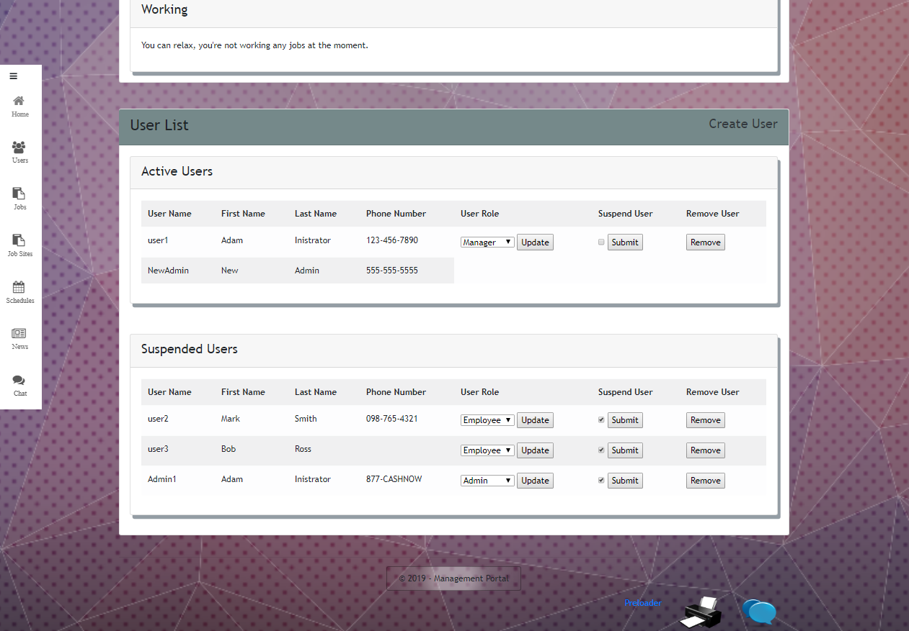
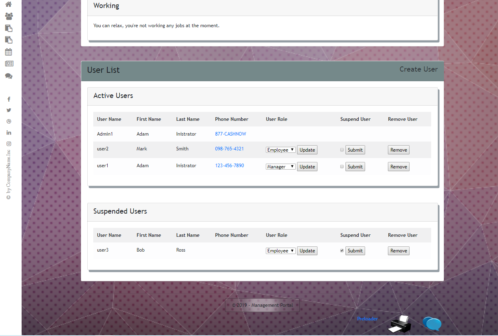

# .NET Live Project-Sprint 2

Personal Code Summary for the second team live project I was a part of at Prosper IT Consulting

## Introduction

During my time at The Tech Academy, I was assigned to 2 two-week sprints working on software to be used as a way to "manage a collection of construction jobs. Admins will be able to create and distribute a weekly schedule assigning users to certain jobs. Users will be able to keep track of which job they are assigned to for the week. There will also be the ability for admins to post company news and announcements, and chat functionality for the users to socialize."

My contributions to this second sprint of the project included adding back-end functionality.  I fixed a bug that allowed the admin to delete them selves, I enabled the app to capture from the database which users were suspended, I created a partial view that allows users to be separated by "active" or "suspended", I enabled a Job object to be deleted along with all of it's attached objects from different tables of the database, and I added a list of all users to the admin Dashboard view.

Listed below are the stories I worked on, a brief description of their expectations, and the code I created to complete them.

## User Stories

- [Remove Ability To Suspend and Change Role for Self](#remove-ability-to-suspend-and-change-role-for-self)
- [Capture Suspended](#capture-suspended)
- [Separate Users by Type](#separate-users-by-type)
- [Deleting a Job with attached objects](#deleting-a-job-with-attached-objects)
- [User List in Dashboard Admin View](#user-list-in-dashboard-admin-view)

## Remove Ability To Suspend and Change Role for Self

When the user is logged in as an admin, they have the ability to suspend or change the role for any user. We don't want the admin to accidentally change their own role. Add in a check in, with an error alert, to make sure the user isn't changing their own status. Test that this works (Create a dummy admin account so you don't accidentally log yourself out of admin abilities!). Once it works, make sure the drop down for user role doesn't display for the logged in user.

Here is the original page:

Add lines 40 - 43 to UserController.cs to prevent user from changing own role:

This throws a user friendly error message if the user tries to change their role from "admin" to anything else.  It then refreshes the screen to re-display current user role as "admin" instead of whatever user tried to change it to.  This is accomplished by calling the Json "message" as added in lines 209 - 212 of Site.js:

This removes functionality from the dropdown Role change menu, but the User Story asks for the removal of the buttons altogether for the active user.  This is accomplished by adding an if loop to the code that displays the dropdown in the _UserList.cshtml partial view file as seen on line 49:

I add this to line 62 in order to get rid of the "Remove User" button from the active user's display, as well.

Here is the finished page (I am logged in as NewAdmin):

### Capture Suspended
There is a checkbox for the suspended bool attribute in the user class, which doesn't actually bind to the property and change the user's status. Have the checkbox actually change the property value, and also have it display properly for the existing value.

In the UserController, I added this bit of code for updating the database to mark a user as "suspended" or not suspended:

I then modified and added code in the _UserList.cshtml partial View to call the Action "SuspendUser":

Finally, I added an Ajax submit form in the Site.js to display warnings, confirmations, and to reload the page with the correct suspended status of each user.

### Separate Users by Type

 Now that we have added the ability to suspend a user, we want to separate them into a different list for the admin. Create a new shared partial view that lists only Suspended users. Filter the old Master User List Partial to not show Suspended Users. Render the partial view in the All Users list.Then add a Link to the Dashboard Users section "View All Users" that will have the Suspended Partial View Display below the Active Users List.    

This is the original  User List in the Admin Dashboard/Home page before:

...and the nav bar:

I start by creating a  _SuspendedUsers partial view that only displays suspended users:

In the Dashboard.cshtml, which is the home page for the Admin, I add a RenderAction of _SuspendedUsers partial:

In the _UserList.cshtml partial view, I add an "if" loop that only displays Users that are not Suspended:

I add "location.reload();" to the Site.js that reloads the page when users are suspended or re-activated:

The User List in the Admin home page/Dashboard now looks like this:

I add an Index View for the User that uses the Index ActionResult in the UsersController:

Then, in the _Layout.cshtml Partial View, I added the ActionLink reference to the Nav Bar:

...displaying this:

The "All Users" link in the nav bar then displays the Users "Index" view:

### Deleting a Job with attached objects
When trying to delete a Job item which is associated with a Schedule item or other items, the application crashes due to database related error.  We need to prevent this crash by creating a "User-Friendly Error Message" and error-handling in the back end. This handling will need to separate out items that may mean the user doesn't want to delete the job, and also make the necessary changes in order to be able to delete both the Job and its associated items successively. 
1) Using dummy jobs, implement the ability to delete a job with all fields filled out or attached (Shift Time, JobSite, JobOther, Manager, etc) - note that JobSite and Manager should not be deleted from the database, but ensure you can delete a job if those are included.
2) Create a pop-up message that tells the user there are still future schedules associated with the job if this is the case, and ask if they want to continue-- include the ability to cancel the request, and this may require sending a bool for future schedules into the ViewBag for client side verification.
3) Add the ability to delete all schedule items associated with the Job if the user wants to delete a job anyway.

The app crashes when user attempts to delete a Job.  Here is the original code in the DeleteConfirmed function in the JobController:

Here is the new code DeleteConfirmed that allows for objects associated with the Job being deleted to also be removed from their respective databases also:  

In order to add a confirmation warning to pop up when a Job is already Scheduled, I add this Javascript function:

If the user presses "OK", the DeleteConfirmed CS function in the JobsController is run, if the user presses "Cancel" the warning box closes.

In order for that warning to only appear when there are one or more Schedules associated with the Job being deleted, the Delete.htmlcs View file is changed from this:

To this:

The IF loop counts the number of Schedules and proceeds accordingly.  I also now display the name of the Job to be deleted as an extra precaution/clarification.

Here is what the user sees:

There are two Dummy Jobs.  One has no Schedules, Two has one Schedule attached.  Here's the Schedule view for reference:

When the user goes to delete "Dummy Job 1" with no schedules attached, they are allowed to delete from this page with no warnings after pressing the "Delete Dummy Job 1" button:

When the user goes to delete "Dummy Job 2" with one schedule attached, the following warning appears after pressing "Delete Dummy Job 2":

Pressing "OK" stays on the current page, while "OK" runs the DeleteConfirmed Controller function.  

Here is the Job list with the two Dummy Jobs deleted:

### User List in Dashboard Admin View

The admin is able to see all User (Active, suspended, and unregistered) by just clicking the " All Users"  navigation item which takes him (Users/Index view page). The Admin is also able to see this list from the Admin Dashboard (Home/Dashboard view page) under User List.  But the "Unregistered Users" are not displayed here. Your job is to fix this bug. 

Before:

This is a very simple story, especially since I already implemented the User/Index view page previously.   Here is the existing code for the Home/Dashboard view page:

I add line 52 though 54 to render the _UnregisteredUsers partial view as I did in User/Index:

And that's it.  The Dashboard page now shows Registered, Suspended, and Unregistered Users in their own categories:

